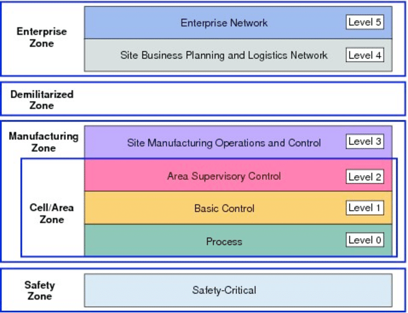

## Introduction
Industrial control systems (ICS) control the critical infrastructure ranging from factory manufacturing and power plants to smart buildings, playing a significant role in the national economy. These systems were orginally developed to operate in a closed environment, communicating over protocols that have no built-in security. Despite this, many protocols were layered on Ethernet and TCP/IP, connecting them to the the public network for remote monitoring and management purposes [1]. If the ICS systems once attacked, it may affect human lives causing significant losses to both economy and environment. Having said that, many companies using both ICS and IT fail to securely integrate them, so it's important to understand the difference in terms of security objective, network topology, performance etc [2]. The security concerns related to ICS are very alarming and need to be addressed with better solutions, which is clearly evident from the attacks in the previous years (Stuxnet attack, Ukrainian Power attack & more). Also, the attack surface are likely to increase in the future generations due to convegergence with Industrial Internet of Things. 
This document is aimed to provide readers a foundation on ICS in general and help them avoid typical pitfalls in their research journey. 

## Typical ICS architecture
ICS implementations vary based on the industries from the main system frameworks, hardware/ software devices to network protocols. To keep account for these variations, the most widely adopted Purdue Model [3], is usually taken as a reference providing a generic platform and terminology for setting up ICS test environments. Based on this reference model, ICS can be divided into six levels across four zones [3] as depicted below:

- **Safety zone:** This zone includes systems and devices that manage the ICS security functions when hardware failures or system outages occur.
- **Manufacturing /Control zone:** This zone includes systems and devices used for control, monitoring and automation of logistic physical processes within an operation site [4]. These systems and devices are deployed at a nearby location to the physcial process and are the core of the entire control system. As per the functions, it can be further divided into process (level 0), basic control (level 1), area supervisory control (level 2) and site manufacturing operations and control (level 3).
- **Demilitarized zone (DMZ):** This zone provides a "buffer zone" where data can be shared between the Manufacturing and Enterprise zones, allowing the data to move beyond geographical constraints of the Manufacturing zone. The purpose of the DMZ is to securely exhcnage IT information without directly exposing critical components in the lower layers to the Internet. The devices present in DMZ are historians, security servers, backup servers and so on [5].
- **Enterprise zone:** - This zone mostly contains conventional non-ICS specific devices and systems, which use the data input from the Manufacturing zone (via the Demilitarized zone) to perform supervisory and planning functions across the whole ICS estate.

### ICS testbed classification
Most of the testbeds have different implementation and configuration methods, based on which they can be divided into the below four categories - physical simulation testbed, software simulation testbed, semi-physical simulation testbed and virtualized testbed [6].

### Component in ICS
- PLCs, DCS, SCADA, RTUs, HMI, PAC, IED, Sensors & Actuators

### Communication protocols used in ICS
An Internet-Wide View of ICS Devices
https://ieeexplore.ieee.org/abstract/document/8551422/references#references
https://www.incibe.es/extfrontinteco/img/File/intecocert/ManualesGuias/incibe_protocol_net_security_ics.pdf

- Proprietary & Open protocols
- Interfaces: RS-232 and RS-485
- Process automation protocols:
Modbus - 
It 

, Siemens S7 (TCP/102), Ethernet/IP (TCP/44818, UDP/2222), HART-IP (TCP/5094)
- Building automation protocols: BACnet (UDP/47808), Niagara Tridium Fox (TCP/1911), CIP
- Power system automation protocols: DNP3 (TCP/20000, UDP/20000), IEC 61850 (TCP/102), ICCP (TCP/102)
- Advanced Metering Infrastructure protocol: ANSI C12.22 (TCP/1153, UDP/1153)
- PROFIBUS and PROFINET
- IO-LINK
- AS-Interface

**Comparative table of the most common ICS protocols
**Protocol, Encryption, Authentication, IP/Transport level, Security concerns

## Analysis of previous ICS incidents
- Stuxnet attack
- Ukrainian power attack
Here are some interesting reads describing the above discussed attacks in more details - [Stuxnet worm impact on industrial cyber-physical system security](https://ieeexplore.ieee.org/abstract/document/6120048) and [The 2015 Ukraine Blackout: Implications for False Data Injection Attacks](https://ieeexplore.ieee.org/abstract/document/7752958).

## ICS security framework

## Demos

## References
1. [An Internet-wide view of ICS devices](https://ieeexplore.ieee.org/document/7906943)
2. [IT vs ICS] (https://resources.infosecinstitute.com/category/certifications-training/ics-scada/ics-protocols/it-ics)
3. [Converged plantwide ethernet (cpwe) design and implementation guide](https://literature.rockwellautomation.com/idc/groups/literature/documents/td/enet-td001_-en-p.pdf)
4. [Pains, Gains and PLCs: Ten Lessons from Building an Industrial Control Systems Testbed for Security Research](https://www.usenix.org/conference/cset17/workshop-program/presentation/green)
5. [Experience and Lessons in Building an ICS Security Testbed](https://www.researchgate.net/publication/336152125_Experience_and_Lessons_in_Building_an_ICS_Security_Testbed)
6. [A survey of industrial control system testbeds](https://iopscience.iop.org/article/10.1088/1757-899X/569/4/042030)
