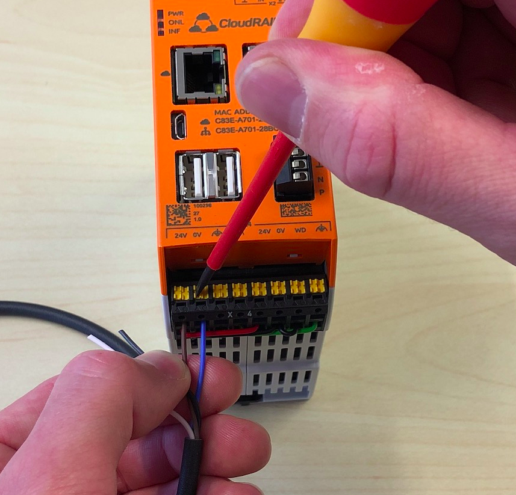
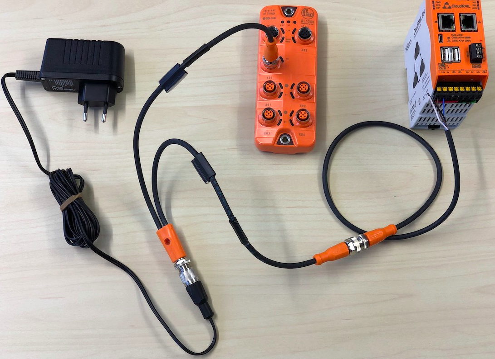
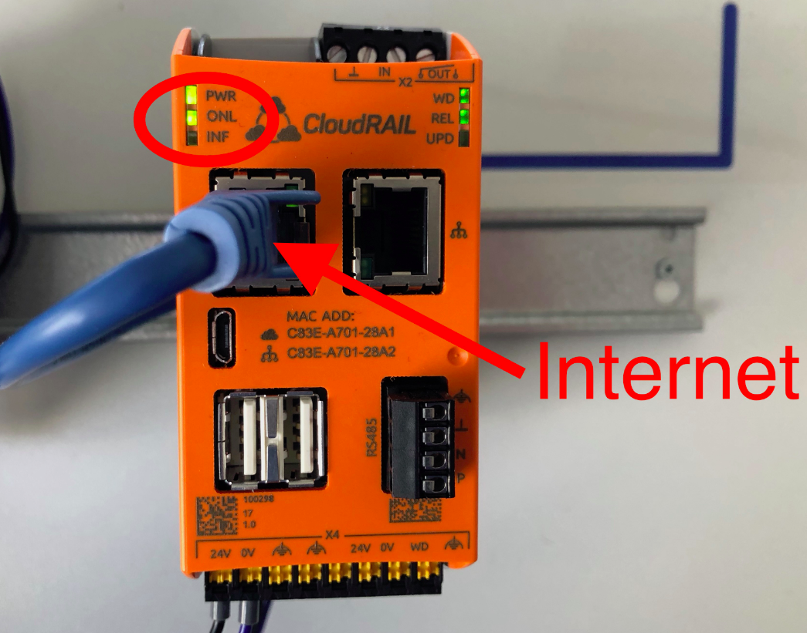
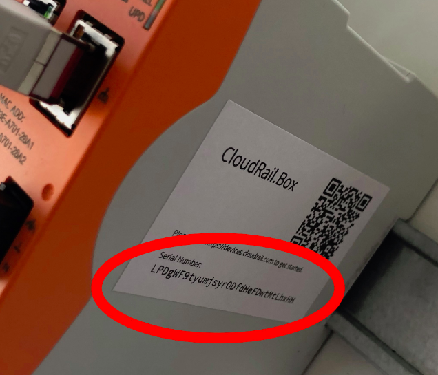
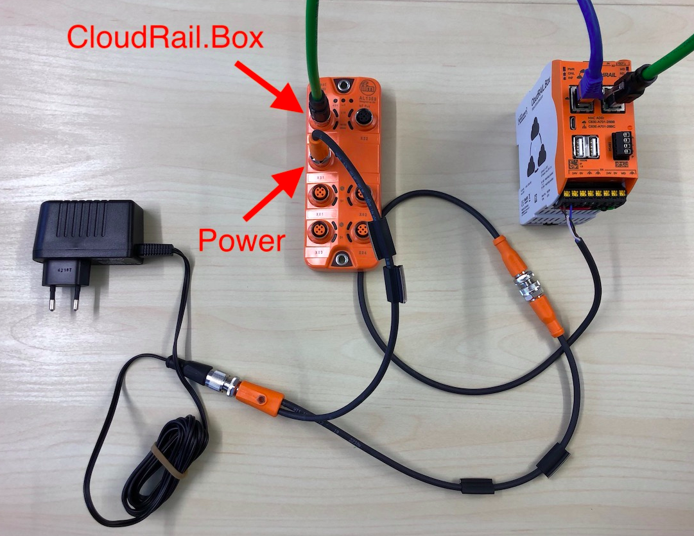
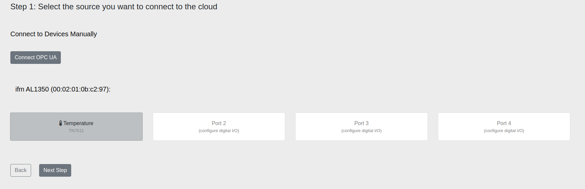
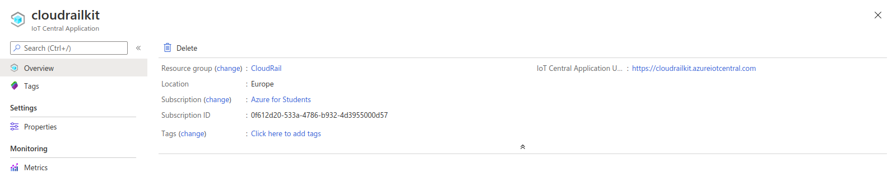
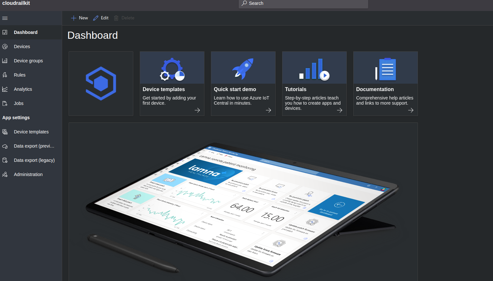
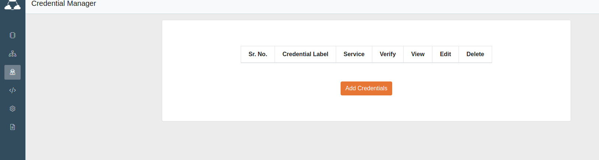
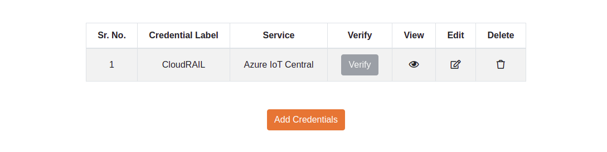

# CloudRAIL IIoT testbed

This document serves as a guide for the testbed installation with brief description of the devices associated in this setup. It also provides a list of some possible attacks with references. 

## Testbed setup

This setup is aimed to demonstrate a convergence of Industrial Control System (ICS)/ Operational Technology (OT) with Industrial Internet of Things (IIoT). In an Industrial Internet of Things (IIoT) environment, ICS devices such as Programmable Logic Controllers (PLCs) and Remote Terminal Units (RTU) interact and exchange data with the IoT devices via IIoT gateways. There is very little understood / known about the methods of exploitation of these covergent ICS/IIoT environemnts, which is also a big motivation for this setup. 

The setup consists of the following:

1. [IoT Starter Kit CloudRAIL.Box Set](https://www.automation24.se/iot-startkit-cloudrail-box-set) - 
This kit contains:
- [CloudRail.box](https://cloudrail.com/cloudrail-iot-box/), acts as an Edge Gateway between the IoT devics and the cloud. It works for [Brownfield environments](https://cloudrail.com/cloudrail-iot-box/io-link-connector/) using secondary sensors and [Greenfield scenarios](https://blog.cloudrail.com/opcua-to-any-cloud/) with OPC-UA. It is based on the Revolution Pi connect hardware technology and is great for beginners as it doesn't need any special configuration and is managed via a central device management cloud.
- [M12 Y connection cable in connection with electronic EVC510](https://www.automation24.se/m12-y-anslutningskabel-ifm-electronic-evc510) 
- [M12 connection cable with male connector in connection with electronic EVC184](https://www.automation24.se/m12-anslutningkabel-med-hankontakt-ifm-electronic-evc184)
- [IO-Link master DataLine IoT ifm electronic AL1350](https://www.ifm.com/de/en/product/AL1350?tab=details)
- [M12 Connection cable in connection with electronic EVC010](https://www.automation24.se/m12-anslutningskabel-ifm-electronic-evc010)
- [Temperature sensor in connection with electronic TN7511](https://www.automation24.se/temperaturgivare-ifm-electronic-tn7511)
- [Jackable power supply ifm electronic E80120](https://www.automation24.se/jackbart-naetaggregat-ifm-electronic-e80120)

2. [Device Management Cloud](https://cloudrail.com/device-management-cloud/), acts as a central place to manage CloudRAIL.Box that includes all connected IO-modules and sensors/actuators. 

## How to use

The installation can also be followed from [Quick Start Guide CloudRail.Box](https://cloudrail.com/quick-start-guide/) and [Linking Cloud Platform to the Device Management Cloud](https://devices.cloudrail.com/documentation). However, this document covers the steps specifically for this starter kit. The IoT kit has been already installed in the lab. Someone who needs to test the installation can skip Step 1 and directly move to Step 2. 

### Step 1 - Setting up the CloudRAIL.box

1. Strip the blue and brown wires from [M12 connection cable with male connector in connection with electronic EVC184](https://www.automation24.se/m12-anslutningkabel-med-hankontakt-ifm-electronic-evc184).
2. Connect the brown cable to the +24V terminal and the blue cable to the 0V terminal as depicted below.

3. Use the [M12 Y connection cable in connection with electronic EVC510](https://www.automation24.se/m12-y-anslutningskabel-ifm-electronic-evc510) to connect the CloudRAIL.box and the IO-Link master to the [Jackable power supply ifm electronic E80120](https://www.automation24.se/jackbart-naetaggregat-ifm-electronic-e80120) .

4. Now connect the ClouRAIL.box to the Internet using the left Ethernet port. 

Once the connection to the Central Device Management is successful, the "ONL" LED will turn green. If the "ONL" LED doesn't turn green, there might be a problem with the Internet connection. 

### Step 2 - Linking the CloudRAIL.Box to the Device Management Cloud

1. First time users need to create a new account on [Device Management Cloud](https://devices.cloudrail.com/signup ) by filling out all necessary details.
2. Once logged in, click on "Connect New Box" and enter the serial number of CloudRAIL.Box. The number is on a label located on the right side of the 	CloudRAIL.Box.

3. By default the CloudRAIL.box uses DHCP to get an IP address. If DHCP is not available in your network, please add the Box to the Device Management Cloud, select it and click on "Advanced Network Settings" to set the network configuration manually.
4. Once you have connected the Box, it will appear in the Device Management cloud. 

The Box will show the following things:
	- Status of the Box (online or offline).
	- Advance Network Settings, to configure the IP address of the Box.
	- Logging, to see logs of the Box
	- Firmware Latest version of the firmware, and if it needs to be updated (IMPORTANT)
	- A list of Attached Devices to the Box.
	- New Connection button, to add a device to the Box.

### Step 3 - Connect the IO-Link Master to the Box

1. Connect the IoT network port to the right ethernet port of the Box (In-case the Box doesn't find the IO-Link master automatically, please restart the master by unplugging it from the power supply while letting the ClouDRAIL.Box being connected to power)

### Step 4 - Adding the device to the Box

1. Once the IO-Link Master is connected, the Box automatically detects [IO-Link master DataLine IoT ifm electronic AL1350](https://www.ifm.com/de/en/product/AL1350?tab=details) and shows the number of available ports. 
2. Now connect the [Temperature sensor in connection with electronic TN7511](https://www.automation24.se/temperaturgivare-ifm-electronic-tn7511) to Port 1, which will then automatically appear in the Device Management Cloud. It will dispay the type (Which in our case is temperature) of sensor it is and the name of the sensor (which in our case is TN7511). 

### Step 5 - Link the preferred Cloud Platform to the Device Management Cloud
Please note - The current CloudRAIL plan is a trial one, which is available upto 1 year and works for our use-case. For more information related to subscription features, go to Account --> Subscriptions in the Device Management Cloud.
The chosen Cloud Platform her eis Microsoft Azure. There is no specific motivation for chosing the same, other than the fact that Microsoft Azure Dev tools is accessible to KTH students for research purposes. 

#### Creating an IoT Central Application
1. Login to the [Microsoft Azure Portal](https://portal.azure.com/) using your KTH account. 
2. After loggin in, click on "Create a resource" button and search for "IoT Central Application".
3. In the "IoT Central Application", click on "Add" to add the below details:
	- Resource name, your IoT Central Application name.
	- Application URL, can be same as the Resource Name.
	- Select Subscription, should be Azure for Students.
	- Resource Group, add any name.
	- Pricing Plan, should be Standard 1/ 2.
	- Template, choose Custom Application.
	- Location, choose depending on your region.
4. Once you have added all the information, click on the "Create button" and the IoT Central Application will take a few minutes to deploy.
5. After the deployment is complete, click on the "Go to resource button" followed by the IoT Central Application link.

6. The IoT Central Application should look this (below). Now you are ready to use IoT Central with the Management Cloud.

#### Saving credentials
There are two ways to add a device in the Device Management Cloud for Azure IoT Central - Saving credentials (Preferred) and Without Saving credentials. Saving credentials allows us to easily and quickly add devices to the Azure IoT Central without entering other details again and again. The credentials will be stored in the Credential Manager as depicted below -

1. In order to use the Credential Manager, we need to generate an API token. Once you reach the Dashboard of the IoT Central Application, click on "Administration", followed by "API token" and then click on "Generate Token".
2. Enter your "Token name: and Select "Admin" or "Builder" as Role. 
3. Click on "Generate button" and save the token somewhere securely as it will be later used in the Credential Manager.
4. We also need the Subdomain and Central DNS. To find these, go to "Administration", followed by "Your application". Subdomain is the Application URL and Central DNS by default is azureiotcentral.com
5. Go to the "Credentials Manager", click on "Add Credentials" and select the prefered Cloud Platform from the drop down list which in our case is the Azure IoT Central.
6. Fill in the details and save it. The credentials can later be viewed, edited or deleted as per the need.

#### Adding the device
1. To add a device, we got back to "My Boxes" and click on "New Connection" of the respective box. 
2. The Box configuration should automatically detect a Temperature Sensor at Port 1. Chose "Temperature: TN7511" and click on Next Step button. 
3. The next section allows us to chose at what frequency should the sensor send data to the cloud, either at a specified interval or when there is a change. 

## Possible attacks

## Future Works

1. Retrofitting old machines
2. Connecting it with PLC

## References

1. [A Reference Architecture for IIoT and Industrial Control Systems Testbeds](https://research-information.bris.ac.uk/ws/portalfiles/portal/186781375/CameraReady_A_Reference_Architecture_for_IIoT_and_Industrial_Control_Systems_Testbeds.pdf)
2. [LICSTER - A Low-cost ICS Security Testbed for Education and Research](https://github.com/hsainnos/LICSTER)
3. [Oops I Did it Again: Further Adventures in the Land of ICS Security Testbeds](https://dl.acm.org/doi/pdf/10.1145/3338499.3357355)
4. [Quick Start Guide CloudRail.Box](https://cloudrail.com/quick-start-guide/)
5. [Linking Cloud Platform to the Device Management Cloud](https://devices.cloudrail.com/documentation)

