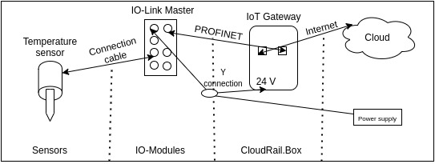

# CloudRAIL IIoT testbed

This document serves as a guide for the testbed installation with brief description of the devices associated in this setup. It also provides a list of some possible attacks with references. 

## Testbed setup

This setup is aimed to demonstrate a convergence of Industrial Control System (ICS)/ Operational Technology (OT) with Industrial Internet of Things (IIoT). In an Industrial Internet of Things (IIoT) environment, ICS devices such as Programmable Logic Controllers (PLCs) and Remote Terminal Units (RTU) interact and exchange data with the IoT devices via IIoT gateways [A Reference Architecture for IIoT and Industrial Control Systems Testbeds](https://research-information.bris.ac.uk/ws/portalfiles/portal/186781375/CameraReady_A_Reference_Architecture_for_IIoT_and_Industrial_Control_Systems_Testbeds.pdf). There is very little understood / known about the methods of exploitation of these covergent ICS/IIoT environemnts, which is also a big motivation for this setup. 

The setup consists of the following:

1. [IoT Starter Kit CloudRAIL.Box Set](https://www.automation24.se/iot-startkit-cloudrail-box-set) - 
This kit contains:
a. [CloudRail.box](https://cloudrail.com/cloudrail-iot-box/), acts as an Edge Gateway between the IoT devics and the cloud. It works for [Brownfield environments](https://cloudrail.com/cloudrail-iot-box/io-link-connector/) using secondary sensors and [Greenfield scenarios](https://blog.cloudrail.com/opcua-to-any-cloud/) with OPC-UA. It is based on the Revolution Pi connect hardware technology and is great for beginners as it doesn't need any special configuration and is managed via a central device management cloud.
b. [M12 Y connection cable in connection with electronic EVC510](https://www.automation24.se/m12-y-anslutningskabel-ifm-electronic-evc510) 
c. [M12 connection cable with male connector in connection with electronic EVC184](https://www.automation24.se/m12-anslutningkabel-med-hankontakt-ifm-electronic-evc184)
d. [IO-Link master DataLine IoT ifm electronic AL1350](https://www.ifm.com/de/en/product/AL1350?tab=details)
e. [M12 Connection cable in connection with electronic EVC010](https://www.automation24.se/m12-anslutningskabel-ifm-electronic-evc010)
f. [Temperature sensor in connection with electronic TN7511](https://www.automation24.se/temperaturgivare-ifm-electronic-tn7511)
h. [Jackable power supply ifm electronic E80120](https://www.automation24.se/jackbart-naetaggregat-ifm-electronic-e80120)

2. [Central Device Management](https://cloudrail.com/device-management-cloud/), acts as a central place to manage CloudRAIL.Box that includes all connected IO-modules and sensors/actuators. 

## How to use

The installation can be followed from [Quick Start Guide CloudRail.Box](https://cloudrail.com/quick-start-guide/) directly. However, I have covered the steps specifically for this starter kit. The IoT kit has been already installed in the lab. Someone who needs to test the installation can skip Step 1 and directly move to Step 2. 

### Step 1 - Setting up the CloudRAIL.box

1. Strip the blue and brown wires from [M12 connection cable with male connector in connection with electronic EVC184](https://www.automation24.se/m12-anslutningkabel-med-hankontakt-ifm-electronic-evc184).
2. Connect the brown cable to the +24V terminal and the blue cable to the 0V terminal as depicted below.

3. Use the [M12 Y connection cable in connection with electronic EVC510](https://www.automation24.se/m12-y-anslutningskabel-ifm-electronic-evc510) to connect the CloudRAIL.box and the IO-Link master to the [Jackable power supply ifm electronic E80120](https://www.automation24.se/jackbart-naetaggregat-ifm-electronic-e80120) .

4. Now connect the ClouRAIL.box to the Internet using the left Ethernet port. 

Once the connection to the Central Device Management is successful, the "ONL" LED will turn green. If the "ONL" LED doesn't turn green, there might be a problem with the Internet connection. 

### 2 - Linking the CloudRAIL.Box to the Central Device Management

1. First time users need to create a new account on [Device Management Cloud](https://devices.cloudrail.com/signup ) by filling out all necessary details.
2. Once logged in, click on "Connect New Box" and enter the serial number of CloudRAIL.Box. The number is on a label located on the right side of the CloudRAIL.Box.

## Possible attacks

## Future Works

## References

